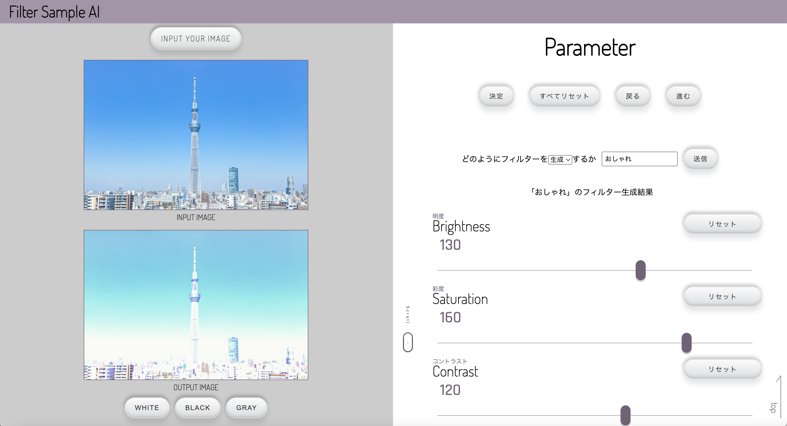
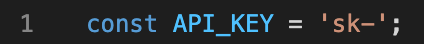

# FilterSampleAI
ChatGPTのAPIを用いて、CSSフィルターを自動で生成してくれるサービス

<kbd></kbd>

## 使い方
①chatgpt.jsの1行目にあるAPI_KEYに自身のChatGPTで取得したAPIキーを入力する。

<kbd></kbd>

②imageConversion.htmlを開く

③画面左側のINPUT YOUR IMAGEから好きな画像を入力する

④画面右側のテキストフォームに作成したいフィルター（例：おしゃれな）を入力して送信ボタンを押す
